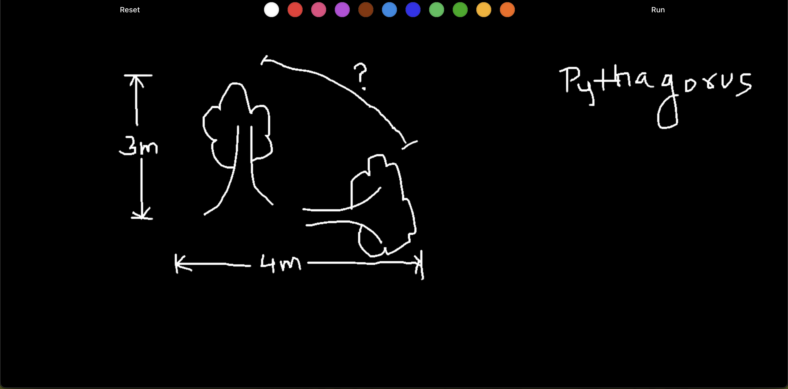
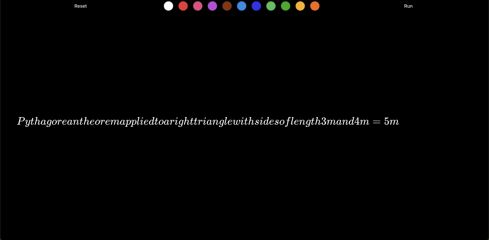
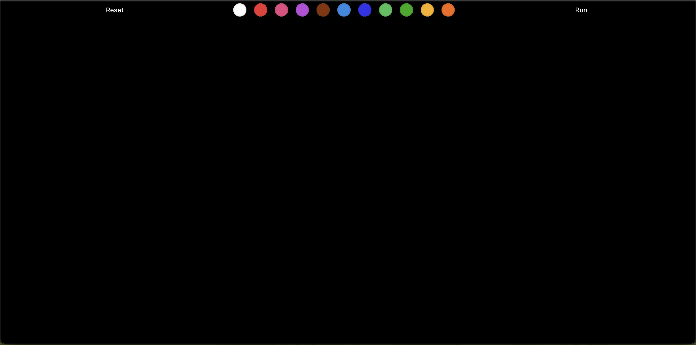

# AI Calculator Website





## Overview

The **AI Calculator Website** is a powerful web application designed to help users solve mathematical problems using AI-driven technology. This tool allows users to draw their math problems on a canvas, which the AI then analyzes to provide solutions, making it an intuitive and flexible platform for tackling a variety of math-related queries.

## Features

- **Canvas Drawing**: Users can draw their math problems on a digital canvas.
- **AI-Powered Responses**: The AI interprets the drawn image and provides accurate mathematical solutions.
- **User-Friendly Interface**: Simple, intuitive UI built using modern web technologies.

## Built With

- **Python**: Backend server logic.
- **Google Gemini**: AI-based features.
- **React**: Frontend framework for building interactive UI components.
- **Vite**: Development environment for a fast, optimized build process.

## Frameworks

- Python (Python is a powerful and versatile programming language used for the backend of this application. It handles server-side logic, processes AI-powered requests, and manages the core functionality of the AI that interprets mathematical problems from the canvas)


- Google Gemini (Google Gemini is a robust AI platform that powers the machine learning capabilities of this application. It processes the images drawn by the users and generates mathematical solutions based on the problem it identifies)


- React (React is a popular JavaScript library used to build the dynamic, responsive frontend of the AI Calculator Website. It ensures a smooth user experience by rendering the interactive UI components like the canvas where users can draw their math problems)


- Vite (Vite is a modern build tool that is faster and leaner than traditional tools like Webpack. It optimizes the development workflow by providing fast, hot-reloading and efficient builds for the frontend React components)

## Getting Started

To run this project, follow the steps below:

### Prerequisites

- Node.js (for client-side development)
- Python 3 (for server-side development)
- Virtual Environment (`venv`)

### Installation

1. Clone the repository:

   ```bash
   git clone https://github.com/your-username/ai-calculator-website.git
   ```

2. Navigate to the client folder:

   ```bash
   cd client
   ```

3. Install the dependencies:

   ```bash
   npm install
   ```

4. Start the development server:

   ```bash
   npm run dev
   ```

5. Navigate to the server folder:

   ```bash
   cd server
   ```

6. Create and activate the virtual environment:

   If using **zsh** terminal:

   ```bash
   source venv/bin/activate
   ```

   If using **fish** terminal:

   ```bash
   source venv/bin/activate.fish
   ```

7. Install the Python dependencies:

   ```bash
   pip install -r requirements.txt
   ```

8. Start the Python server:

   ```bash
   python3 main.py
   ```

## Contributors

- **Rohit Kumar** – [Portfolio](https://www.rohitsaraf.in)

## Screenshots



## License

This project is licensed under the MIT License - see the [LICENSE](LICENSE) file for details.
